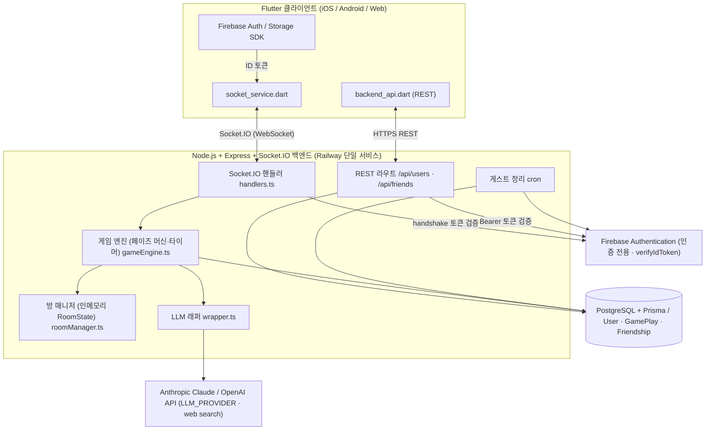
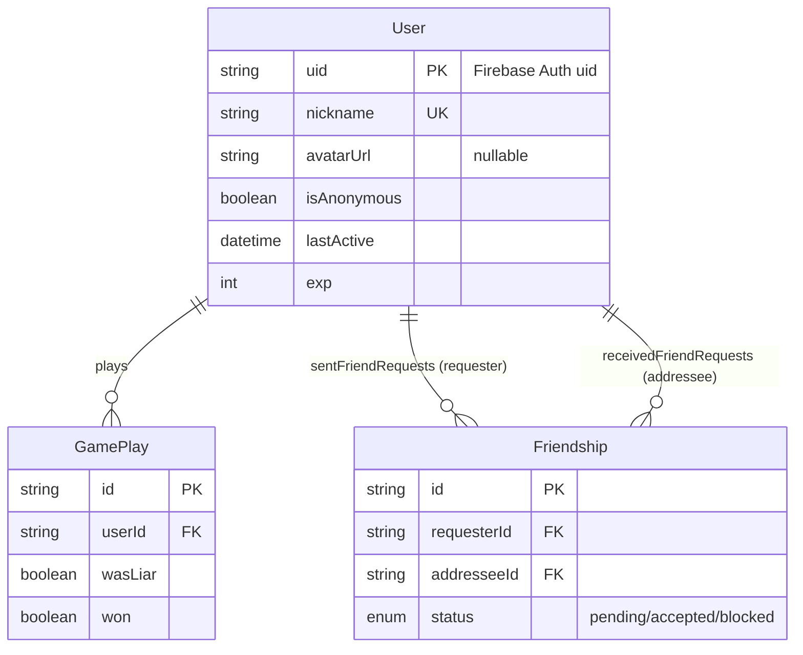

# 26s-w2-c3-06

## 공통과제 II : 협업형 실전 산출물 제작 (2인 1팀)

**목적:** 실시간 인터랙션, LLM Wrapper, Cross-Platform 중 하나의 옵션을 선택해 구현하며, 선택한 기술을 실제로 동작하는 형태의 산출물로 완성한다.

**선택 옵션:**

| 옵션 | 설명 |
|---|---|
| 실시간 인터랙션 | 사용자 간 상태 변화, 실시간 데이터 흐름, 스트리밍 응답 등 실시간성이 드러나는 기능을 구현 |
| LLM Wrapper | LLM API를 활용하여 AI 기능이 포함된 산출물을 구현 |
| Cross-Platform | 하나의 산출물을 여러 실행 환경에서 사용할 수 있도록 구현* |

> *데스크톱 앱 ↔ 모바일 앱; 혹은 다른 폼팩터에서의 앱; 웹만/웹 기반 프레임워크(Electron, Tauri 등) 대신 다른 프레임워크를 시도해보는 것을 적극 권장

**결과물:** 선택한 옵션이 적용된 작동 가능한 산출물, 실행 가능한 코드, 시연 자료 및 관련 문서

---

## 목차

- [팀원](#팀원)
- [선택 옵션](#선택-옵션)
- [기획안](#기획안)
- [구현 명세서](#구현-명세서)
- [아키텍처](#아키텍처)
- [설계 문서](#설계-문서)
- [산출물 및 실행 방법](#산출물-및-실행-방법)
- [회고 문서](#회고-문서)
- [참고 자료](#참고-자료)

---

## 팀원

| 이름 | 학교 | GitHub | 역할 |
|---|---|---|---|
| 김혜리 | 한양대 | [ireyhye](https://github.com/ireyhye) | Frontend |
| 조준호 | KAIST | [milleion](https://github.com/milleion) | Backend |

---

## 선택 옵션

- [x] 실시간 인터랙션
- [x] LLM Wrapper
- [x] Cross-Platform

---

## 기획안

- **산출물 주제:** AI가 개입하는 라이어게임 — 프로젝트명 **L-AI-R GAME**
- **제작 목적:** 실시간 인터랙션 · LLM Wrapper · Cross-Platform 세 옵션을 하나의 게임 산출물로 통합 구현
- **선택 옵션:** 실시간 인터랙션 + LLM Wrapper + Cross-Platform
- **핵심 구현 요소:**
  - 방장이 정한(또는 AI가 랜덤 생성한) 카테고리로 진짜/가짜 제시어 쌍을 LLM이 생성 — 라이어는 비슷하지만 다른 가짜 제시어를 받고, 자신이 라이어인지도 모름
  - 인원 부족 시 방장이 원하는 수만큼 AI 봇이 플레이어로 참여해 자연스럽게 설명을 생성 (봇도 자신이 라이어인지 모름 — 사람과 동일 조건)
  - 토론 페이즈 동안 AI가 3~7초 무작위 간격으로 참가자 한 명인 척 자유 채팅에 끼어들어 교란 — 그 사람의 실제 senderId로 나가 AI 개입이라는 티가 전혀 나지 않고, 게임 종료 후에도 공개되지 않음
- **사용 / 시연 시나리오:** 참가자들이 각자 기기(웹/모바일)에서 공개방 목록 선택 또는 4자리 코드로 같은 방에 입장 → 방장이 카테고리·AI 봇 수를 설정하고 게임 시작 → 그룹 채팅 형태의 화면에서 순서대로 제시어 설명 제출 → 자유 토론(이때 AI가 참가자인 척 끼어들어 교란) → 익명 투표로 라이어 지목 → 결과 공개, 라이어로 지목되면 진짜 제시어를 맞혀 역전승 시도
- **팀원별 역할:** 김혜리 — Frontend(Flutter, iOS/Android/Web), 조준호 — Backend(Node/Express, Socket.IO, LLM 연동)

### 개발 일정

| 날짜 | 목표 |
|---|---|
| Day 1 | 백엔드 기본 구조 설계 · Socket.IO 서버 구축 · 방/게임/라운드 상태 모델링 |
| Day 2 | Firebase Auth 토큰 검증 연동 · 소켓 이벤트 계약 설계 · 로그인 플로우 구현 |
| Day 3 | LLM 래퍼 구현 · 제시어 쌍 생성 · AI 봇 턴 생성 프롬프트 작성 |
| Day 4 | 게임 상태 머신 구현 · 페이즈 전이 (대기 → 설정 → 설명 → 토론 → 투표 → 결과 → 역전승) |
| Day 5 | 토론 페이즈 AI 사칭 메시지 실시간 구현 · 라이어 역전승 로직 · 백엔드 완성도 높이기 |
| Day 6 | 프론트엔드 UI 구현 (로그인 · 로비 · 방 화면) · Socket.IO 클라이언트 연동 · 상태 동기화 |
| Day 7 | 통합 테스트 · 버그 수정 · 모바일/웹 반응형 디자인 검수 · 시연 영상 준비 |

---

## 구현 명세서

| 구현 요소 | 설명 | 우선순위 | 상태 |
|---|---|---|---|
| 공개/비공개 방 (Socket.IO) | 로비 공개방 목록 조회·입장, 4자리 코드 비공개방 입장, 실시간 플레이어·준비 상태 동기화, 새로고침 후 `room:rejoin` 상태 복구 | 필수 | ✅ 구현 완료 |
| 게임 진행 상태 머신 | 대기 → 설정 → 설명 → 토론 → 투표 → 결과 → (역전승 시도) → 종료 페이즈 전이를 서버가 전적으로 소유하고 타이머 관리 | 필수 | ✅ 구현 완료 |
| LLM 제시어 쌍 생성 | 카테고리(직접 입력·프리셋 칩·AI 랜덤) 기반 진짜/가짜 제시어 쌍 생성, 실제 웹 검색으로 실존·한국인 친숙도 검증 | 필수 | ✅ 구현 완료 |
| AI 봇 플레이어 | 방장이 지정한 수만큼 봇이 참여해 사람과 동일 조건(자신이 라이어인지 모름)으로 설명 생성 | 필수 | ✅ 구현 완료 |
| 토론 페이즈 AI 사칭 | 토론 중 3~7초 무작위 간격으로 참가자 한 명인 척 자유 채팅에 끼어들어 교란(그 사람 실제 senderId로 전송, 끝까지 비공개) | 필수 | ✅ 구현 완료 |
| Firebase Auth 로그인 | 익명/이메일/Google 로그인, 소켓 handshake + REST 양쪽에서 ID 토큰 검증(`verifyIdToken`) | 필수 | ✅ 구현 완료 |
| 익명 투표 · 동점 재투표 | 서버만 집계(개인 투표 절대 비공개), 동점 시 동점자만 재설명·재투표 반복 | 필수 | ✅ 구현 완료 |
| 라이어 역전승 | 투표로 지목된 사람이 실제 라이어면 진짜 제시어를 맞혀 역전승, LLM이 정답 유사판정 | 필수 | ✅ 구현 완료 |
| 통합 채팅 피드 | 턴 설명·시스템 안내·자유 채팅(AI 사칭 포함)이 하나의 `chat:message` 피드로 흐름 | 필수 | ✅ 구현 완료 |
| 유저 전적·친구 (로컬 DB) | 게임 결과를 PostgreSQL+Prisma에 영구 저장 → 전적 4종·경험치/레벨·친구(요청/수락, 온라인 프레젠스) | 선택 | ✅ 구현 완료 |
| 프로필 사진 · 게스트 정리 | Firebase Storage 아바타 업로드, `node-cron`으로 30일 미접속 익명 계정 6시간마다 정리 | 선택 | ✅ 구현 완료 |

---

## 아키텍처

세 옵션(실시간 인터랙션 · LLM Wrapper · Cross-Platform)을 하나의 게임으로 통합한 구성이다. Flutter 단일 코드베이스(iOS/Android/Web) 클라이언트가 Node/Express + Socket.IO 백엔드에 방 단위로 접속하고, 백엔드는 방/게임/라운드 상태를 인메모리로 소유하며 게임 진행에 필요한 시점마다 LLM 래퍼(Anthropic/OpenAI)를 호출해 결과를 실시간 브로드캐스트한다.



- **실시간 인터랙션**: 단일 기본 네임스페이스 + Socket.IO room(`socket.join(roomCode)`). 서버가 페이즈 전이·타이머를 전적으로 소유하고, 투표는 개인 선택을 어떤 클라이언트에도 전송하지 않고 서버 내부 집계로만 쓴다. 통합 `chat:message` 피드로 턴 설명·시스템 안내·자유 채팅이 한 리스트에 흐른다.
- **LLM Wrapper**: `wrapper.ts`가 provider(Anthropic/OpenAI)와 모델을 얇게 감싸 `LLM_PROVIDER` 환경변수로만 전환(미지정 시 사용 가능한 키 기준 자동 선택, 둘 다 있으면 OpenAI 우선). 제시어 쌍 생성·단어 설명은 실제 웹 검색으로 실존·사실을 검증한다. 프롬프트·파싱·거절 감지는 provider와 무관하게 공유하며, 키가 하나도 없으면 고정 mock 응답으로 폴백한다.
- **Cross-Platform**: Flutter 단일 코드베이스로 iOS/Android/Web 빌드. 웹은 백엔드가 정적 파일을 same-origin으로 함께 서빙한다.
- **배포**: 리포 루트 `Dockerfile` 멀티스테이지 빌드(백엔드 tsc + Flutter web) → Railway 단일 서비스. 인메모리 게임 상태 때문에 서버리스 대신 컨테이너 호스팅을 택했고, Express가 API와 Flutter 웹 정적 파일을 함께 서빙해 CORS를 단순화했다.

---

## 설계 문서

> 프로젝트 성격에 따라 필요한 항목만 작성

### 화면 / 인터페이스 설계

픽셀아트 UI. 화면은 6개 — ① 메인(로그인/회원가입·게스트로 계속하기) ② 로그인/회원가입(Google 통합 버튼 + 이메일 폼) ③ 로비(공개방 목록·코드 입장·방 만들기·내 전적/레벨/프로필) ④ 개인정보 수정(닉네임·아바타·로그아웃/탈퇴) ⑤ 친구 관리(닉네임 기반 요청·수락·온라인 표시) ⑥ 방(게임 진행). 방 화면은 `screens/room/room_screen.dart` 한 파일로, 채팅 리스트는 고정하고 하단 영역만 현재 페이즈(대기/설명/토론/투표/역전승/결과)에 따라 분기해, 게임 채팅과 방 채팅이 하나의 피드로 유지된다. 게스트↔회원 계정 전환 충돌을 피하려 방 화면에는 로그인/로그아웃 버튼 자체를 두지 않는다.

### 데이터 구조

방/게임/라운드 같은 휘발성 상태는 **인메모리**, 유저·전적·친구는 **로컬 PostgreSQL(Prisma)** 에 저장한다. 계층은 로비(Lobby) > 방(Room) > 게임(Game) > 라운드(Round).

**인메모리 (요약)** — `backend/src/types.ts`

```ts
interface RoomState {
  roomCode: string;            // 4자리 숫자 문자열
  hostId: string;              // 방장 판별의 단일 source of truth
  title: string; emoji: string; visibility: 'public' | 'private';
  maxPlayers: number;          // 사람+봇 합산 상한 (방장 지정)
  players: Player[];           // { id, nickname, isBot, connected, isReady }
  customCategories: string[];  // 이 방에서 쓴 카테고리(재사용용, 방 종료 시 소멸)
  draftConfig: { category: string | null; aiBotCount: number };
  chatLog: ChatMessage[];      // 방 유지 동안 보존, 새 게임 시작 시에만 초기화
  currentGame: GameState | null;
}
interface GameState {
  gameNumber: number; category: string;
  realWord: string; liarWord: string;
  liarIds: string[];           // 서버 전용 비밀(라이어 본인도 모름), 길이 1 고정
  participantIds: string[]; participants: { id; nickname; isBot }[];
  phase: 'setup' | 'describing' | 'discussion' | 'voting' | 'resolution' | 'liarGuess' | 'ended';
  playerOrder: string[]; rounds: Round[];
  tieCandidates: string[] | null;
  votes: Record<string, string>; // 서버 전용, 클라이언트로 절대 전송 안 함
  votedOutId?: string; wasLiar?: boolean; winner?: 'liar' | 'citizens';
}
interface ChatMessage {
  id: string; senderId: string | 'ai' | 'system';
  type: 'chat' | 'turnDescription' | 'system'; text: string; timestamp: number;
}
```

**영구 저장 (요약)** — `backend/prisma/schema.prisma`. Firebase `uid`를 PK로 삼아 이 DB가 유저 데이터를 소유하고, Firebase Auth는 인증 전용으로만 쓴다(Firestore 미사용).

- `User` — `uid`(PK) · `nickname`(전역 유일) · `avatarUrl` · `isAnonymous`(게스트 구분) · `lastActive`(정리 기준) · `exp`(누적 경험치, **단조증가만 — 절대 감소 없음**)
- `GamePlay` — 사람 1명이 게임 1판을 마칠 때 1행. `wasLiar`/`won`만 저장하고 전적 4종(전체 게임수·전체/라이어/시민 승률)은 이 집계로 파생
- `Friendship` — 요청→수락 모델, 방향(requester/addressee) 보존, `onDelete: Cascade`
- **레벨**: 누적 EXP에서 계산하는 파생값(저장 안 함). `EXP(L) = 100 × (L−1) + 15 × (L−1) × (L−2)`



### API / 외부 서비스 연동

실시간 게임 진행은 **Socket.IO 이벤트**, 실시간성이 필요 없는 전적·친구 CRUD는 **Express REST**로 나눴다. REST는 `GET /api/users/nickname-availability/:nickname`만 인증 예외이고 나머지는 `Authorization: Bearer <Firebase ID Token>`이 필수다. 아래는 핵심 계약 발췌.

| Method / 방식 | Endpoint / 서비스 | 설명 | 요청 | 응답 | 비고 |
|---|---|---|---|---|---|
| Socket ↑ | `room:create` | 방 생성(4자리 코드 발급) | `{ nickname, visibility, maxPlayers, title?, emoji? }` | `room:created` | 코드 충돌 시 재생성 |
| Socket ↑ | `room:join` / `room:rejoin` | 코드 입장 / 재접속 복구 | `{ roomCode, nickname }` | `room:joined` / `room:rejoined` | 만원·진행중이면 `room:error` |
| Socket ↑ | `game:configure` | 게임 시작(호스트 전용) | `{ category: string\|null, aiBotCount }` | `game:started` | 전원 준비 + 3명 이상일 때만 |
| Socket ↑ | `turn:submitDescription` | 내 차례 설명 제출 | `{ text }` | `chat:message`(turnDescription) | 현재 턴만 유효 |
| Socket ↑ | `discussion:adjustTime` | 토론 남은 시간 ±10초 | `{ deltaSec }` | `discussion:started` 재브로드캐스트 | 참가자별 단축·연장 각 1회 |
| Socket ↑ | `vote:cast` / `vote:confirm` | 익명 투표 선택 / 확정 | `{ votedPlayerId }` / `{}` | `vote:progress` | 개인 선택 절대 비공개 |
| Socket ↑ | `liar:guessWord` | 역전승 정답 제출 | `{ guess }` | `round:finalResult` | 지목된 실제 라이어만 |
| Socket ↓ | `chat:message` | 통합 채팅 피드 | — | `{ id, senderId, type, text, timestamp }` | AI 사칭 메시지도 이 경로 |
| Socket ↓ | `round:yourWord` | 내 제시어 개별 전송 | — | `{ word, explanation }` | 진짜/가짜 여부 미포함 |
| Socket ↓ | `round:resolved` / `round:finalResult` | 투표 결과 / 최종 결과 | — | 지목·라이어 여부·제시어·승패 | 큰 알림창으로 표시 |
| REST GET | `/api/users/me` | 내 전적·경험치·레벨 | Bearer | `{ totalGames, overallWinRate, liarWinRate, citizenWinRate, exp, level }` | 승률 분모 0이면 `null` |
| REST PUT/PATCH/DELETE | `/api/users/me` · `/me/avatar` | 닉네임·아바타·회원탈퇴 | Bearer + body | 204 | 탈퇴는 Firebase+DB 동시 삭제 |
| REST | `/api/friends` · `/api/friends/requests` | 친구 목록·요청·수락 | Bearer | `Friendship` / 목록 | 회원끼리만(게스트 403) |
| 외부 | Firebase Authentication | 익명/이메일/Google 인증 | ID 토큰 | `verifyIdToken` | 인증 전용 (Firestore 미사용) |
| 외부 | Firebase Storage | 프로필 아바타 업로드 | `avatars/{uid}` | 다운로드 URL | 본인 uid 경로만 |
| 외부 | Anthropic Claude / OpenAI | 제시어·봇·사칭·설명·판정 | 프롬프트(+ web search) | 텍스트 | `LLM_PROVIDER`로 전환 |

---

## 산출물 및 실행 방법

- **산출물 설명:** 실시간 멀티플레이 AI 라이어게임 **L-AI-R GAME**. 온라인 방에서 사람과 AI 봇이 함께 제시어를 설명하고, AI가 토론에 몰래 끼어들어 교란하며, 익명 투표로 라이어를 찾는 크로스플랫폼 게임. 배포 주소: https://l-ai-r-game.madcamp-kaist.org
- **Android APK:** 빌드 없이 바로 설치해볼 수 있도록 리포 루트에 릴리즈 APK([`l-ai-r-game.apk`](./l-ai-r-game.apk))를 함께 올려뒀다. 설치 방법은 아래 "Android APK로 바로 설치" 참고.
- **실행 환경:** iOS / Android / Web (Flutter 단일 코드베이스). 백엔드는 Node.js 22 + PostgreSQL. 배포는 Railway 단일 서비스(백엔드가 Flutter 웹 정적 파일도 함께 서빙).
- **실행 방법:** 아래 참고 — Android는 APK를 바로 설치하거나, 로컬은 Postgres(Docker) → 백엔드 → 프론트 순으로 띄운다.
- **시연 영상 / 이미지:** (선택)

### Android APK로 바로 설치

소스 빌드 없이 배포된 서버(`l-ai-r-game.madcamp-kaist.org`)에 바로 접속하는 릴리즈 APK를 리포 루트에 올려뒀다.

1. [`l-ai-r-game.apk`](./l-ai-r-game.apk)를 안드로이드 기기로 전송(카카오톡/이메일/USB 등)하거나 기기 브라우저에서 GitHub 리포로 직접 다운로드
2. 기기에서 "설정 → 보안 → 출처를 알 수 없는 앱 설치 허용" 켜기 (앱 설치 시 안내 팝업에서 바로 허용해도 됨)
3. 다운로드한 apk 파일을 탭해 설치 후 실행 — 별도 설정 없이 배포된 백엔드로 바로 연결된다

adb가 있다면 `adb install l-ai-r-game.apk`로도 설치 가능하다.

### 실행 방법 (소스 빌드)

```bash
# 0) 사전 준비: Docker 데몬이 떠 있어야 한다 (Colima 사용 시 `colima start` 먼저)

# 1) 로컬 Postgres 기동 (backend/docker-compose.yml)
cd backend
docker compose up -d            # localhost:5432, DB: liar_game

# 2) 백엔드 (Node 22, Express + Socket.IO)
cp .env.example .env            # DATABASE_URL / (선택) ANTHROPIC_API_KEY·OPENAI_API_KEY·LLM_PROVIDER
                                #   · LLM 키가 하나도 없으면 고정 mock 응답으로 동작
                                #   · GOOGLE_APPLICATION_CREDENTIALS 없으면 dev용 토큰검증 생략 fallback
npm install
npm run prisma:generate         # Prisma 클라이언트 생성
npm run prisma:migrate          # 로컬 DB에 스키마 적용
npm run dev                     # tsx watch → http://localhost:3000

# 3) 프론트엔드 (Flutter)
cd ../frontend
flutter pub get
flutter run                     # 디바이스/에뮬레이터 선택 실행
# 웹으로 실행:  flutter run -d chrome
# 실제 기기로 실행(백엔드가 localhost가 아닐 때):
#   flutter run --dart-define=BACKEND_URL=http://<백엔드-IP-또는-도메인>:3000
# 프로덕션 웹 빌드:  flutter build web --release   (결과물 build/web/ 을 백엔드가 서빙)
```

### 기술 구성

| 분류 | 사용 기술 |
|---|---|
| 핵심 기술 | Flutter(Dart), Node.js + Express 5 + Socket.IO 4, Anthropic Claude API / OpenAI API (web search 포함) |
| 실행 환경 | iOS / Android / Web (Flutter 단일 코드베이스), 배포 Railway(Docker 멀티스테이지 빌드) |
| 데이터 저장 | 인메모리(방/게임/라운드 휘발성 상태), PostgreSQL 16 + Prisma(유저·전적·친구·경험치 영구 저장) |
| 외부 API / 서비스 | Firebase Authentication(익명/이메일/Google, 인증 전용), Firebase Storage(프로필 아바타), Anthropic Claude / OpenAI(`LLM_PROVIDER`로 전환) |
| 상태관리 / 클라이언트 | Riverpod, `socket_io_client`, `firebase_core`/`firebase_auth`/`firebase_storage`, `google_sign_in`, `http`, `shared_preferences` |
| 백엔드 / 인프라 | `firebase-admin`(토큰 검증·계정 삭제), Prisma(ORM), `node-cron`(게스트 정리), `tsx`/TypeScript, Docker + Railway(+ 매니지드 Postgres) |

---

## 회고 문서

> [KPT 방법론 참고](https://velog.io/@habwa/%EB%8B%A8%EA%B8%B0-%ED%94%84%EB%A1%9C%EC%A0%9D%ED%8A%B8-%ED%9A%8C%EA%B3%A0-KPT-%EB%B0%A9%EB%B2%95%EB%A1%A0)

### Keep — 잘 된 점, 다음에도 유지할 것

- **서버 권위(server-authoritative) 설계** — 페이즈 전이·타이머·투표 집계를 서버가 전적으로 소유하고 클라이언트엔 판정 로직을 두지 않아, 상태 불일치와 치팅 여지를 원천적으로 줄였다.
- **단일 `RoomScreen` + 페이즈 분기 구조** — 게임 채팅과 방 채팅을 하나의 피드로 유지해 UI가 단순해지고, 새로고침 후 `room:rejoin` 상태 복구도 자연스러웠다.
- **얇은 LLM 래퍼** — `LLM_PROVIDER` 환경변수만으로 Anthropic↔OpenAI를 전환하고, 프롬프트·파싱을 provider와 무관하게 공유했다. 키가 없으면 mock으로 폴백해 개발·시연이 수월했다.

### Problem — 아쉬웠던 점, 개선이 필요한 것

- Firebase Storage SDK가 버킷 CORS 설정을 무시하고 항상 `*`를 반환해, CORS 좁히기의 실질 보안 효과가 없었다 — 진짜 방어선은 Storage Rules(로그인 + 본인 uid)뿐임을 뒤늦게 확인했다.
- 배포 컨테이너의 `docker-entrypoint.sh`가 dash `echo`로 서비스 계정 `private_key`의 개행을 깨뜨려 `verifyIdToken`이 전면 실패했고(전적·프로필·소켓 인증 전부 마비), 원인 파악에 시간이 걸렸다(`printf '%s'`로 해결).
- Flutter 웹 특유의 입력 이슈(두 번째 게임부터 채팅 입력이 죽는 포커스/`readOnly` 토글 버그 등) 재현·수정에 공수가 들었다.

### Try — 다음번에 시도해볼 것

- 아직 stretch로 남은 **게임 내 라운드 재시작**, **라이어 다수 선택**, **방별 Socket.IO 네임스페이스**.
- 방장이 자유 입력하는 **커스텀 카테고리에 대한 최소 검증**(부적절 입력 필터링).
- 전적 조회 빈도가 높아질 경우 `GamePlay` 집계 대신 `User` 캐시 카운터를 두는 최적화 검토.

### 팀원별 소감

**김혜리:**

> 

**조준호:**

> 게임 개발은 처음이었는데 정말 재밌었습니다. 실시간 인터랙션에서 이런저런 버그가 많이 발생했는데 고치느라 애먹었습니다. 특히 LLM이 괜찮은 답을 주도록 프롬프트 짜는게 정말 어렵더라고요. 랜덤성을 주기 위해 3가지 선택지를 생성하도록 하고 서버 측에서 랜덤하게 그 중 하나를 생성하도록 하는 로직이 주효했던 게 기억에 남네요.

---

## 참고 자료

### 실시간 인터랙션

**WebSocket**
- https://developer.mozilla.org/en-US/docs/Web/API/WebSockets_API
- https://techblog.woowahan.com/5268/
- https://tech.kakao.com/posts/391
- https://daleseo.com/websocket/
- https://kakaoentertainment-tech.tistory.com/110

**Socket.IO**
- https://socket.io/docs/v4/
- https://inpa.tistory.com/entry/SOCKET-%F0%9F%93%9A-Namespace-Room-%EA%B8%B0%EB%8A%A5
- https://adjh54.tistory.com/549
- https://fred16157.github.io/node.js/nodejs-socketio-communication-room-and-namespace/

**SSE (Server-Sent Events)**
- https://developer.mozilla.org/en-US/docs/Web/API/Server-sent_events
- https://developer.mozilla.org/ko/docs/Web/API/Server-sent_events/Using_server-sent_events
- https://api7.ai/ko/blog/what-is-sse

**TCP / UDP Socket**
- https://docs.python.org/3/library/socket.html
- https://inpa.tistory.com/entry/NW-%F0%9F%8C%90-%EC%95%84%EC%A7%81%EB%8F%84-%EB%AA%A8%ED%98%B8%ED%95%9C-TCP-UDP-%EA%B0%9C%EB%85%90-%E2%9D%93-%EC%89%BD%EA%B2%8C-%EC%9D%B4%ED%95%B4%ED%95%98%EC%9E%90

**gRPC Streaming**
- https://grpc.io/docs/what-is-grpc/core-concepts/
- https://tech.ktcloud.com/entry/gRPC%EC%9D%98-%EB%82%B4%EB%B6%80-%EA%B5%AC%EC%A1%B0-%ED%8C%8C%ED%97%A4%EC%B9%98%EA%B8%B0-HTTP2-Protobuf-%EA%B7%B8%EB%A6%AC%EA%B3%A0-%EC%8A%A4%ED%8A%B8%EB%A6%AC%EB%B0%8D
- https://tech.ktcloud.com/entry/gRPC%EC%9D%98-%EB%82%B4%EB%B6%80-%EA%B5%AC%EC%A1%B0-%ED%8C%8C%ED%97%A4%EC%B9%98%EA%B8%B02-Channel-Stub
- https://inspirit941.tistory.com/371
- https://devocean.sk.com/blog/techBoardDetail.do?ID=167433

**WebRTC**
- https://developer.mozilla.org/en-US/docs/Web/API/WebRTC_API
- https://webrtc.org/getting-started/overview
- https://web.dev/articles/webrtc-basics?hl=ko
- https://devocean.sk.com/blog/techBoardDetail.do?ID=164885
- https://beomkey-nkb.github.io/%EA%B0%9C%EB%85%90%EC%A0%95%EB%A6%AC/webRTC%EC%A0%95%EB%A6%AC/
- https://gh402.tistory.com/45
- https://on.com2us.com/tech/webrtc-coturn-turn-stun-server-setup-guide/

**QUIC / WebTransport**
- https://developer.mozilla.org/en-US/docs/Web/API/WebTransport_API
- https://datatracker.ietf.org/doc/html/rfc9000
- https://news.hada.io/topic?id=13888

#### KCLOUD VM / Cloudflare Tunnel 환경별 주의사항

| 환경 | 사용 가능(권장) 기술 | 포트/조건 | 주의할 기술 |
|---|---|---|---|
| **로컬 / 일반 VM** | HTTP/REST, WebSocket, Socket.IO, SSE, TCP Socket, gRPC Streaming, WebRTC, QUIC/WebTransport 등 대부분 가능 | 직접 포트 개방 가능. 예: 3000, 5000, 8000, 8080, 9000 등. 외부 공개 시 방화벽/보안그룹/공인 IP 설정 필요 | WebRTC는 STUN/TURN 필요 가능. QUIC/WebTransport는 HTTP/3 · UDP 지원 필요 |
| **KCLOUD VM (VPN 내부)** | HTTP/REST, WebSocket, Socket.IO, SSE, WebRTC 시그널링 | 접속 기기 VPN 필요. 기본 허용 포트: **22, 80, 443**. 개발 포트(3000, 8000, 8080 등)는 직접 접근 제한 가능 | TCP Socket은 포트 제한 있음. gRPC는 HTTP/2 설정 필요. WebRTC 미디어·UDP·QUIC/WebTransport 비권장 |
| **KCLOUD VM + Tunnel** | HTTP/REST, WebSocket, Socket.IO, SSE, WebRTC 시그널링 | VM의 `localhost:<port>`를 도메인에 연결. `localPort`는 **1024~65535**. 예: 3000, 8000, 8080 가능 | 순수 TCP Socket, UDP, WebRTC 미디어/DataChannel, QUIC/WebTransport 불가. gRPC 보장 어려움 |
| **외부 서비스 + 우리 도메인** | HTTP/REST, WebSocket, Socket.IO, SSE, WebRTC 시그널링 | Vercel/Netlify/Railway/Render/AWS/GCP 등에 배포 후 CNAME/A 레코드 연결. 보통 외부는 **443** 사용 | WebSocket/gRPC/TCP/UDP는 플랫폼 지원 여부 확인 필요. 서버리스 플랫폼은 장시간 연결 제한 가능 |
| **서버 없이 외부 SaaS 사용** | Supabase Realtime, Firebase, Pusher/Ably, LLM API Streaming | 직접 포트 관리 불필요. 각 서비스 SDK/API 사용 | 커스텀 TCP/UDP 서버 구현 불가. WebRTC는 STUN/TURN 필요할 수 있음 |

### LLM Wrapper

- https://github.com/teddylee777/openai-api-kr
- https://github.com/teddylee777/langchain-kr
- https://devocean.sk.com/blog/techBoardDetail.do?ID=167407
- https://mastra.ai/docs

### Cross-Platform

- https://flutter.dev/
- https://reactnative.dev/
- https://docs.expo.dev/
- https://kotlinlang.org/multiplatform/
